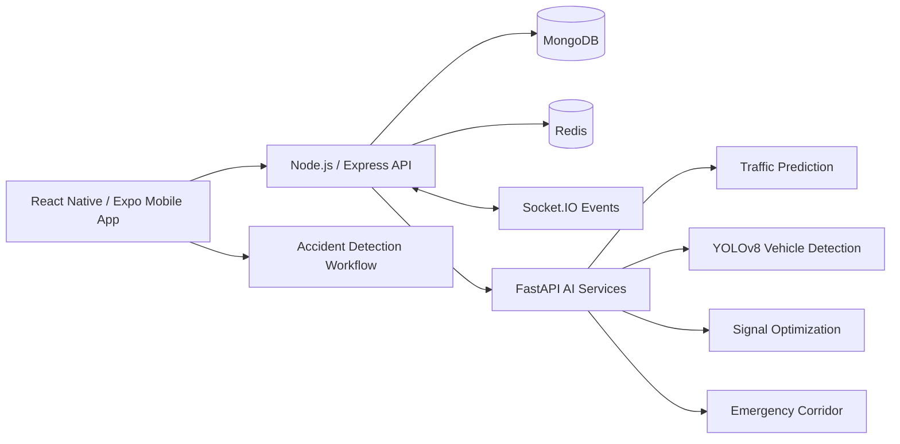

# Traffic AI System

A full-stack traffic intelligence and road-safety platform combining a React Native mobile application, Node.js backend, and Python/FastAPI AI services.

## Overview

Traffic AI System brings together traffic monitoring, vehicle detection, traffic prediction, traffic signal optimization, accident detection, road-issue reporting, emergency alerts, and emergency-corridor workflows in one multi-service project.

## Implemented capabilities

- React Native and Expo mobile client
- Node.js and Express REST API
- MongoDB-backed application data
- Socket.IO real-time events
- JWT-based authentication flow
- Traffic prediction service using a Random Forest regressor
- Vehicle detection service using YOLOv8
- Traffic signal optimization service
- Accident detection workflow in the mobile application
- Emergency alert and emergency-corridor services
- Road-issue reporting and community verification flows
- Docker Compose development environment

## Architecture



## Technology stack

- **Mobile:** React Native, Expo, TypeScript
- **Backend:** Node.js, Express, Socket.IO
- **AI services:** Python, FastAPI, scikit-learn, pandas, NumPy, Ultralytics YOLO
- **Data:** MongoDB, Redis
- **Deployment:** Docker and Docker Compose
- **Security foundations:** Helmet, rate limiting, JWT authentication, environment-based configuration

## Repository structure

```text
traffic_ai_system/
├── ai/                  # FastAPI services and traffic intelligence modules
├── backend/             # Express API, routes, controllers, and middleware
├── mobile/              # React Native / Expo application
├── docker/              # Dockerfiles, Compose, Nginx, and monitoring config
├── README.md
├── .gitignore
└── package-lock.json
```

## Setup

### Requirements

- Node.js 18 or newer
- Python 3.11 or newer
- MongoDB 7 or newer, or Docker
- Redis 7 or newer, or Docker
- Expo tooling for mobile development

### Environment configuration

Copy the example configuration files and replace placeholders locally. Do not commit real passwords, API keys, JWT secrets, or cloud credentials.

```bash
cp backend/.env.example backend/.env
cp docker/.env.example docker/.env
```

### Backend

```bash
cd backend
npm install
npm run dev
```

### AI services

```bash
cd ai
python -m venv .venv
# Activate the environment using the command for your operating system.
pip install -r requirements.txt
python main.py
```

### Mobile application

```bash
cd mobile
npm install
npx expo start
```

For a physical device, configure the mobile API base URL to point to the development machine rather than `localhost` on the phone itself.

### Docker

```bash
cd docker
docker compose --env-file .env up -d
```

The Compose file is intended for local development and demonstration. Review exposed ports and credentials before using it outside a local environment.

## Key API areas

### Backend API

- `/api/users` — registration, login, and profiles
- `/api/traffic` — traffic data and traffic operations
- `/api/issues` — road issue reporting and verification
- `/api/emergency` — emergency alerts and coordination
- `/api/rewards` — civic rewards and coupons
- `/api/health` — backend health status

### AI API

- `POST /api/v1/traffic/predict`
- `POST /api/v1/traffic/congestion-analysis`
- `POST /api/v1/vehicles/detect`
- `POST /api/v1/vehicles/count`
- `POST /api/v1/signals/optimize`
- `POST /api/v1/emergency/corridor`
- `PUT /api/v1/emergency/corridor/{corridor_id}/update`
- `DELETE /api/v1/emergency/corridor/{corridor_id}`
- `GET /health`

## Accident detection

Accident detection is part of the project’s road-safety workflow and is implemented in the mobile application. The project should be evaluated on a real device with the required permissions, sensor behavior, backend connectivity, and emergency-notification configuration.

The repository does not claim that the system has been validated for every device, road condition, or production emergency-response scenario.

## Prototype and fallback behavior

Some services include fallback or simulation paths for development when model files, historical data, cameras, or databases are unavailable. These paths help the application remain testable, but their generated values are not real-world measurements or benchmark results.

In particular:

- Vehicle-count fallback responses can be simulated.
- Traffic prediction falls back to rule-based values when a model is unavailable.
- Some analytics methods remain prototype-level.
- Performance and accuracy should be measured independently before being reported as results.

## Testing

The repository contains service code and application structure for testing. Run the test commands that are present in the relevant package configuration, and document any local infrastructure required for integration tests.

Before presenting benchmark numbers, record the dataset, hardware, test procedure, and results.

## Security configuration

- Keep `.env` files local and untracked.
- Replace all Docker development passwords before shared or deployed use.
- Use strong, unique JWT and database secrets.
- Restrict CORS origins outside local development.
- Do not expose MongoDB, Redis, Grafana, or monitoring ports publicly without access controls.
- Review uploaded-file handling and authentication before production deployment.

## Known limitations

- Some AI and analytics paths are prototypes or use fallbacks.
- Mobile networking requires environment-specific API configuration.
- Docker Compose defaults are designed for local development.
- Production-scale performance, model accuracy, and emergency-response reliability are not claimed without reproducible measurements.
- The accident-detection workflow still requires device-level and end-to-end validation for each target deployment.

## Future improvements

- Add reproducible model evaluation and benchmark reports.
- Improve device and sensor compatibility testing for accident detection.
- Add automated integration tests across mobile, backend, and AI services.
- Replace broad development CORS settings with environment-specific allowlists.
- Improve model lifecycle and artifact management.
- Consolidate the remaining historical setup and status documents into `docs/`.

## License

No repository-level license file was identified during the audit. Confirm licensing before redistribution or commercial use.
